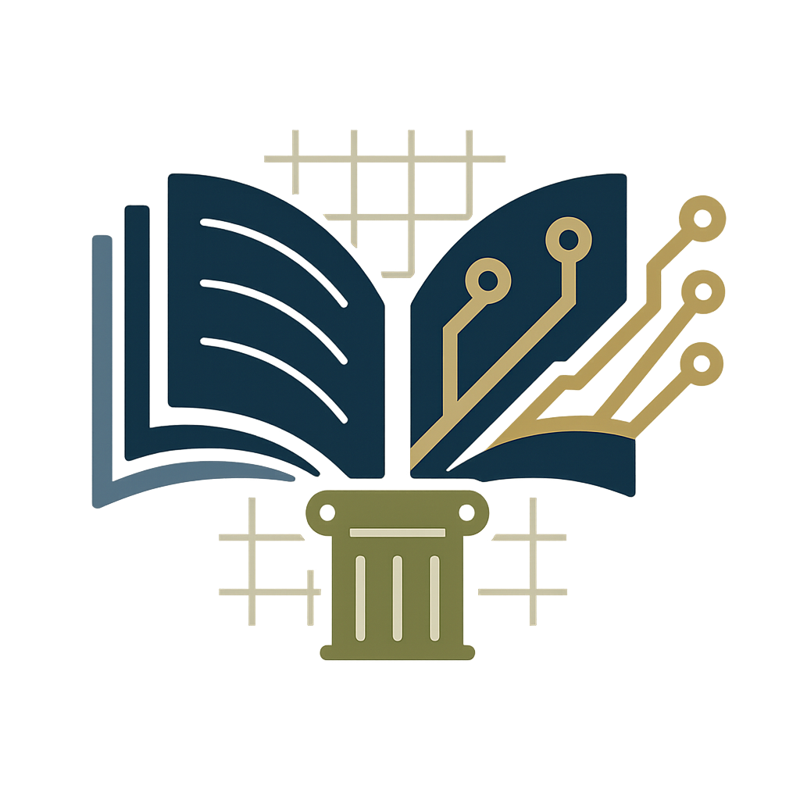

# Institutional Knowledge

_Preserve the Past. Inform the Future_



## What Is Institutional Knowledge?

Institutional Knowledge is a **searchable archive system** for document collections spanning decades. It transforms scattered physical and digital documents into a queryable knowledge base, powered by AI and document processing.

The system is designed for any organisation that needs to preserve, organise, and search deep institutional memory: family estates, small organisations, farms, local governments, scientific research groups, community archives, and more.

### The Problem It Solves

For any long-established institution, critical knowledge lies buried in paper and scattered digital storage: land transactions, infrastructure records, legal agreements, correspondence, personnel records, research notes, meeting minutes, and institutional history. This knowledge is:

- **Scattered** across physical archives, email, file shares, and storage systems
- **Unsearchable** — finding a specific fact means manually reviewing hundreds or thousands of pages
- **At risk** — knowledge passes between people; original documents can be lost, damaged, or forgotten
- **Siloed** — institutional memory depends on individuals rather than being documented and discoverable

### How It Works

1. **Intake** — Upload documents (PDFs, scans, images) via web UI or bulk import
2. **Processing** — AI extracts text, detects metadata (dates, people, locations, organisations), and generates embeddings
3. **Curation** — Review extracted content, correct metadata, maintain a domain vocabulary
4. **Query** — Ask natural language questions and get answers with citations

### A Living Archive, Not a Static One

The traditional challenge of archiving is that you _must_ be an expert on day one—defining categories, relationships, and controlled vocabularies upfront before you can organize documents. Institutional Knowledge inverts this: AI suggests categorisation, relationships, and vocabulary as documents are processed, and curators refine these suggestions iteratively.

You don't need to understand the entire system upfront. Instead, you review AI suggestions, correct them, and gradually build institutional knowledge. Over time:

- The system learns domain-specific vocabulary from corrections
- Relationships between entities (people, places, organisations, events) emerge from the documents themselves
- The archive grows more intelligent with each document processed and curated
- New questions become answerable as the knowledge graph deepens

This approach transforms archiving from a daunting upfront task into an **ongoing, iterative process** where the system and curator learn together.

### Example Questions

For a **family estate**:
> _"What is known about the drainage works in the east meadow?"_

For a **research group**:
> _"What were the key findings from experiments on bacterial growth in high pH environments?"_

For a **local government archive**:
> _"Which properties were affected by the 1998 flooding?"_

For a **small organisation**:
> _"What agreements do we have with our primary suppliers?"_

The system searches the archive, extracts relevant passages, and returns synthesised answers with sources. Example response:

```text
Answer: The drainage works in the east meadow were completed in 1974
by Harrison & Sons Ltd. They included new French drains along the
western boundary and a sump pit installed in the southeast corner.

Sources:
  - 1974-03-15: East Meadow Drainage Works (Invoice, Estate Archive)
  - 1974-05-22: Letter from J. Harrison, Estate Manager (Correspondence)
```

### Key Features

✓ **End-to-end pipeline** — From document upload to searchable answers
✓ **AI-powered extraction** — Automatic text extraction and metadata detection (dates, people, organisations, locations)
✓ **Domain vocabulary** — Learn institution-specific terms, concepts, and relationships
✓ **Sourced answers** — Every answer includes citations to original documents
✓ **Human in the loop** — Review queue for quality control and vocabulary curation
✓ **Graph-aware retrieval** — Understand relationships between entities across documents
✓ **Provider-agnostic design** — Swap OCR, embedding, and LLM providers via configuration
✓ **Multi-phase development** — Phase 1 proves the concept locally; Phase 2+ expand to multi-user and hosted access

### What It Does NOT Do

- Provide public or anonymous access (designed for private institutional use)
- Give legal, medical, or specialist advice (users are responsible for interpreting documents)
- Process photos, audio, or video (text-based documents only)
- Answer questions outside the archive's scope — all answers are sourced from documents
- Replace human expertise (designed to augment human knowledge, not replace expert review)

---

## Project Status

**Phase 1** (current) — Local single-user pipeline with document intake, processing, curation, and CLI query.

- ✅ Architecture and requirements approved (all 41 ADRs, 138 requirements, 101 user stories)
- ✅ All foundational skills written (13 skill files)
- ⏳ Agent creation in progress (2 of 8 agents created)
- Implementation not yet started

See [documentation/](documentation/) for detailed specifications, architecture decisions, and project roadmap.

---

## Documentation

- **[Overview](documentation/project/overview.md)** — Full feature and scope details
- **[Architecture](documentation/project/architecture.md)** — System design and technology choices
- **[System Diagrams](documentation/project/system-diagrams.md)** — Visual system architecture and component flows
- **[Architecture Decisions](documentation/decisions/architecture-decisions.md)** — Design rationale and decisions (all 41 ADRs)
- **[Setup & Development](documentation/SUMMARY.md)** — How to set up the project and .claude/ agents

---
