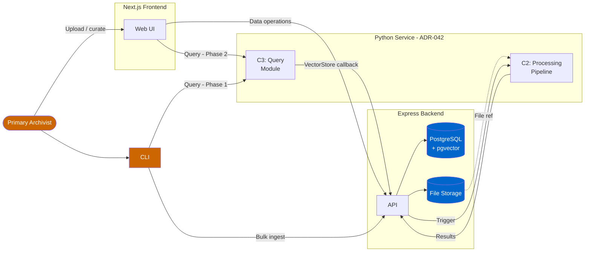
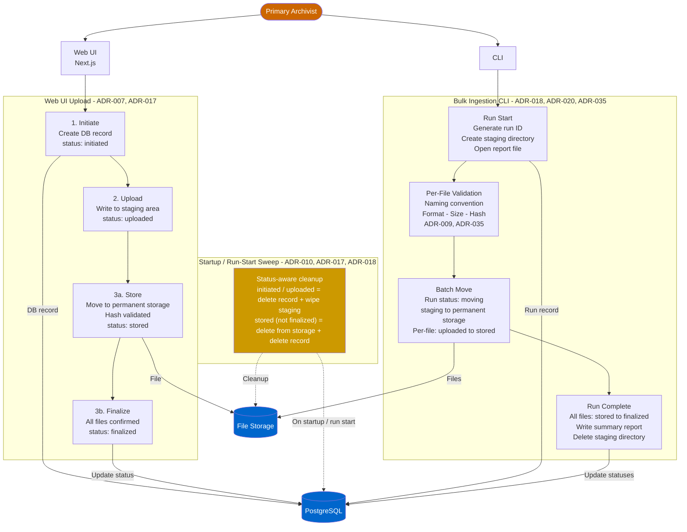
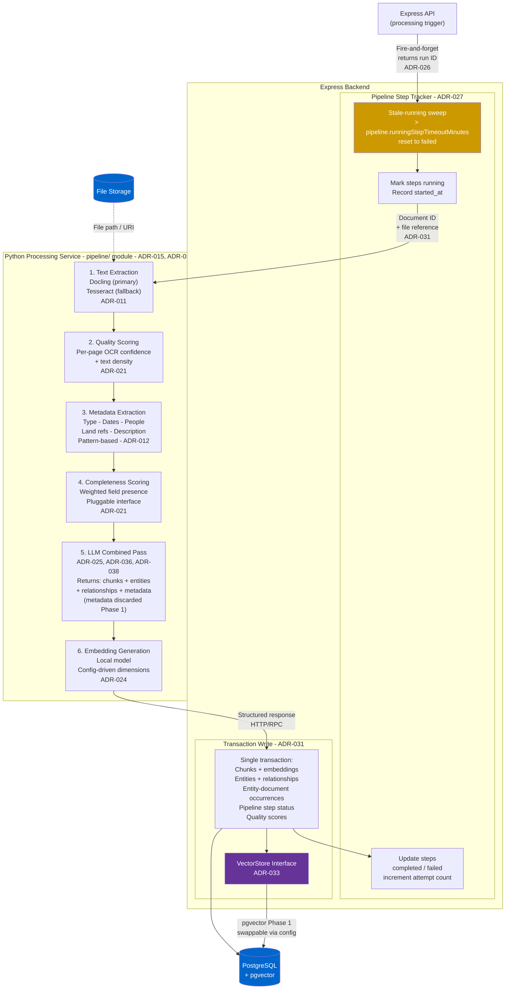
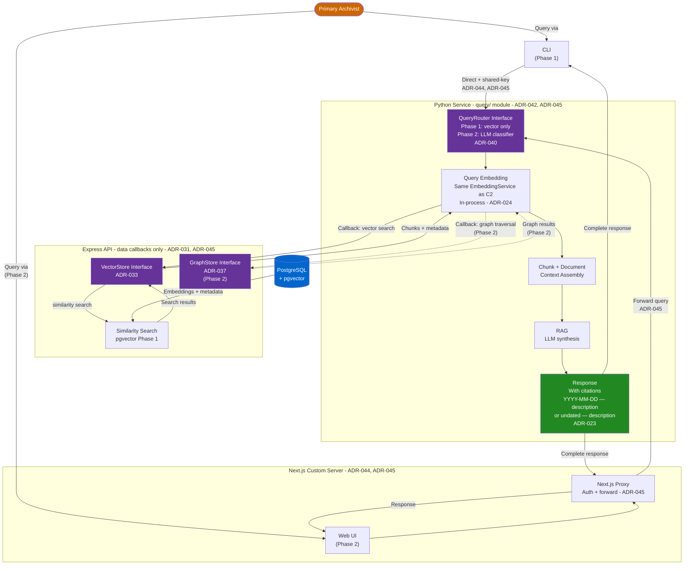

# System Diagrams

Four diagrams describing the Institutional Knowledge system architecture. Each diagram is
self-contained and can be read independently. Reflects ADR-001 through ADR-046.

---

## 1. System Overview

High-level view of components and services. No internal detail.

---

## 2. C1 - Document Intake Detail

Two intake routes, validation, staging, and file lifecycle.

---

## 3. C2 - Processing Pipeline Detail

Express trigger, Python steps, result write-back.

---

## 4. C3 - Query and Retrieval Detail

Next.js proxies web UI queries to Python; CLI calls Python directly (direct network access — no boundary layer needed). Python owns the full pipeline. **Phase 1 focus**: vector retrieval. Graph-aware retrieval via GraphStore (ADR-037) is deferred to Phase 2, where QueryRouter becomes an LLM classifier (ADR-040). C3 query code runs as a separate module (`query/`) within the Python processing service, sharing `EmbeddingService` in-process (ADR-042, ADR-044, ADR-045).

